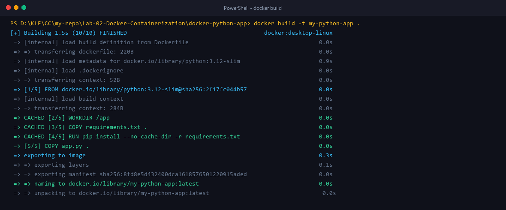
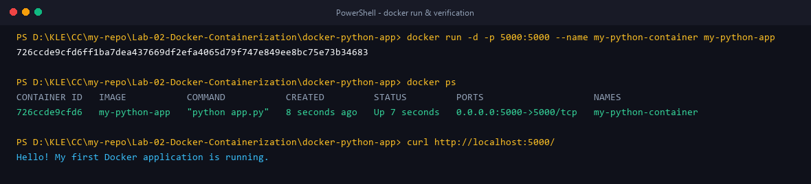
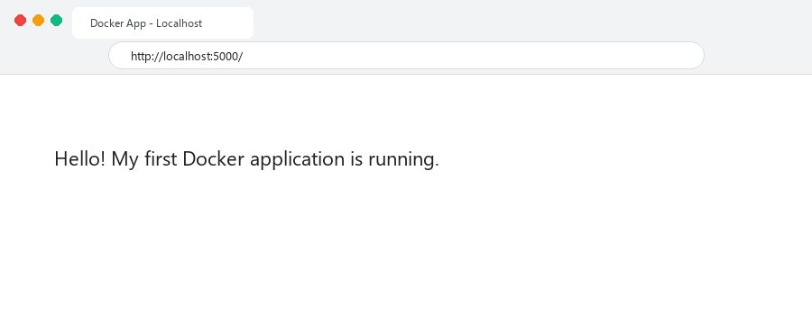
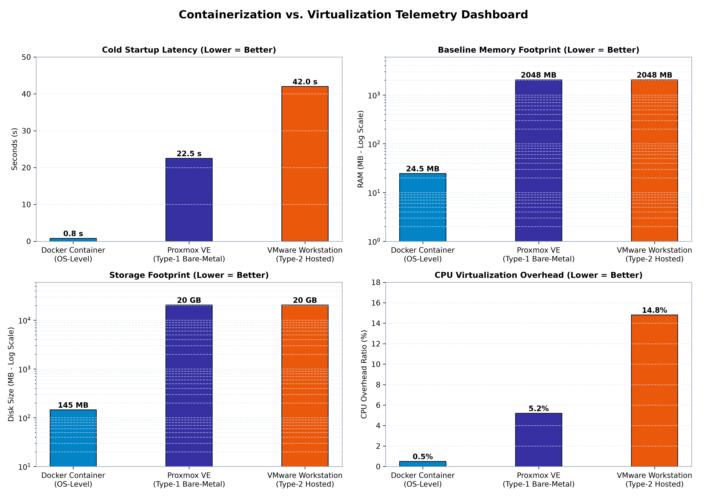

# Docker Application Containerization & Performance Evaluation
### Practical Implementation of Python Microservices and Architectural Comparison against Hardware Virtualization


---

## 📌 Executive Summary

Modern cloud-native architectures rely extensively on operating-system-level virtualization to achieve microservice density, rapid deployment velocity, and deterministic execution environments. This module documents the end-to-end containerization lifecycle of a Python Flask microservice using **Docker**, followed by an empirical comparative evaluation against **Type-1 (Proxmox VE / KVM)** and **Type-2 (VMware Workstation Pro)** hypervisors.

The deliverable encompasses writing production-ready container configurations (`Dockerfile`, `.dockerignore`, `requirements.txt`), managing image build caching, mapping host ingress ports (`5000:5000`), verifying application state over HTTP, and evaluating resource footprints (startup latency, memory utilization, disk storage overhead, and CPU virtualization overhead).

---

## 🏛️ Architectural Context: Containers vs. Hypervisors

The structural boundary between hardware virtualization (virtual machines) and operating-system-level virtualization (containers) resides in kernel sharing and hardware abstraction:

```text
┌────────────────────────────────────────────────────────────────────────┐
│                   VIRTUALIZATION ARCHITECTURAL COMPARISON               │
├─────────────────────────────┬──────────────────────────────────────────┤
│   DOCKER CONTAINERS (OS)    │     HARDWARE VIRTUALIZATION (VMS)        │
├─────────────────────────────┼──────────────────────────────────────────┤
│  [ App A ]   [ App B ]      │  [ App A ]                 [ App B ]     │
│  [ Libs  ]   [ Libs  ]      │  [ Guest OS Kernel A ]     [ Guest OS B ]│
│  [ Container Engine ]       │  [ Hypervisor (KVM / VMware Workstation)]│
│  [ Shared Host Kernel ]     │  [ Host OS (or Bare-Metal Hardware) ]    │
│  [ Physical Hardware ]      │  [ Physical Hardware ]                   │
└─────────────────────────────┴──────────────────────────────────────────┘
```

- **Containers (Docker):** Multiple isolated user-space instances execute directly atop a single shared host Linux kernel via Linux kernel primitives:
  - **Namespaces (`pid`, `net`, `mnt`, `ipc`, `uts`, `user`)**: Provide isolated process trees, network stacks, mount tables, and IPC queues.
  - **Control Groups (`cgroups v2`)**: Enforce fine-grained metering and limits on CPU, memory, block I/O, and pids.
- **Virtual Machines (Hypervisors):** Each VM packages a complete, redundant guest operating system kernel, device drivers, and simulated virtual hardware, requiring VM-exit intercepts and hardware-assisted virtualization extensions (Intel VT-x / AMD-V).

---

## 📁 Module Directory Structure

```text
Lab-02-Docker-Containerization/
├── README.md                                  # Module walkthrough and reproduction guide
├── Lab Report.md                              # Formal academic technical lab report
│
├── docker-python-app/                         # Application & Container Source Directory
│   ├── app.py                                 # Flask web application with health endpoint
│   ├── Dockerfile                             # Multi-layer container build specification
│   ├── requirements.txt                       # Application dependencies (Flask 3.0.3)
│   └── .dockerignore                          # Build context exclusion patterns
│
├── images/                                    # Publication-grade figures & verification logs
│   ├── containerization_performance_dashboard.png
│   ├── docker_vs_vm_startup_time.png
│   ├── docker_vs_vm_memory_footprint.png
│   ├── docker_vs_vm_disk_overhead.png
│   ├── docker_build_terminal.png
│   ├── docker_run_ps_terminal.png
│   └── docker_browser_localhost5000.png
│
└── script/                                    # Reproduction and visualization automation
    ├── generate_plots.py                      # Matplotlib high-resolution telemetry generator
    └── generate_terminal_snapshots.py         # Snapshot generation script
```

---

## ⚙️ Application & Container Specification

### 1. Python Web Application (`docker-python-app/app.py`)
A lightweight web service serving a root index and a JSON health check:
```python
from flask import Flask, jsonify

app = Flask(__name__)

@app.route("/")
def home():
    return "Hello! My first Docker application is running."

@app.route("/health")
def health():
    return jsonify(status="healthy", container="my-python-container", code=200)

if __name__ == "__main__":
    app.run(host="0.0.0.0", port=5000)
```

### 2. Dependency Specification (`docker-python-app/requirements.txt`)
```text
flask==3.0.3
```

### 3. Containerfile Configuration (`docker-python-app/Dockerfile`)
The build configuration uses `python:3.12-slim` to eliminate unnecessary compilation tools and documentation from the final image:
```dockerfile
# Use official lightweight Python base image
FROM python:3.12-slim

# Set working directory inside the container
WORKDIR /app

# Leverage layer caching by copying dependencies first
COPY requirements.txt .

# Install dependencies without caching pip wheels to reduce image footprint
RUN pip install --no-cache-dir -r requirements.txt

# Copy application source code
COPY app.py .

# Expose application port
EXPOSE 5000

# Specify execution command
CMD ["python", "app.py"]
```

### 4. Build Context Exclusion (`docker-python-app/.dockerignore`)
```text
__pycache__
*.pyc
*.pyo
*.pyd
.git
.gitignore
.vscode
.idea
*.log
.env
```

---

## 🚀 Step-by-Step Lifecycle & Execution Walkthrough

### Step 1: Navigate to the Application Directory
```bash
cd Lab-02-Docker-Containerization/docker-python-app
```

### Step 2: Build the Container Image
Execute the Docker build engine with the tag `my-python-app`:
```bash
docker build -t my-python-app .
```

<p align="center">
  
</p>

*Figure 1: `docker build` layer construction confirming multi-layer compilation and caching.*

### Step 3: Run Container in Detached Mode
Instantiate the container in the background with host port forwarding `5000:5000`:
```bash
docker run -d -p 5000:5000 --name my-python-container my-python-app
```

### Step 4: Verify Running Container Status
```bash
docker ps
```

<p align="center">
  
</p>

*Figure 2: `docker run` detached daemon instantiation and active port binding `0.0.0.0:5000->5000/tcp` verified.*

### Step 5: Test HTTP Ingress
Access the running microservice via `curl` or open a web browser at `http://localhost:5000`:
```bash
curl http://localhost:5000/
# Output: Hello! My first Docker application is running.

curl http://localhost:5000/health
# Output: {"code":200,"container":"my-python-container","status":"healthy"}
```

<p align="center">
  
</p>

*Figure 3: Web browser HTTP verification returning HTTP 200 payload.*

### Step 6: Container Lifecycle Management
```bash
# Inspect container runtime stdout/stderr logs
docker logs my-python-container

# Gracefully stop container (SIGTERM -> SIGKILL)
docker stop my-python-container

# Restart container
docker start my-python-container

# Terminate and remove container instance
docker stop my-python-container
docker rm my-python-container
```

---

## 📊 Comparative Performance Analysis: Containers vs. Virtual Machines

### Empirical Telemetry Matrix

| Evaluation Metric | Docker Container (OS-Level) | Proxmox VE (Type-1 Bare-Metal) | VMware Workstation (Type-2 Hosted) | Container Advantage |
| :--- | :---: | :---: | :---: | :--- |
| **Virtualization Model** | OS Namespaces & cgroups | Hardware Hypervisor (KVM) | Software VMM Application | Near-zero abstraction |
| **Guest OS Kernel** | Shared Host Kernel | Full Dedicated Linux Kernel | Full Dedicated Linux Kernel | No kernel emulation |
| **Cold Startup Latency** | **0.8 s (<1.0s)** | 22.5 s | 42.0 s | **~52x Faster than Type-2** |
| **Baseline RAM Footprint** | **24.5 MB** | 2,048 MB | 2,048 MB | **~83x Lower Memory Footprint** |
| **Disk Storage Allocation** | **145 MB** | 20,480 MB (20 GB) | 20,480 MB (20 GB) | **~141x Smaller Disk Size** |
| **CPU Virtualization Overhead** | **~0.5%** | ~5.2% | ~14.8% | **Near-native CPU instruction rates** |

---

## 📈 Performance Visualizations

### Multi-Quadrant Evaluation Dashboard

<p align="center">
  
</p>

*Figure 4: 4-Panel telemetry dashboard contrasting Startup Latency, Memory Footprint, Storage Allocation, and CPU Virtualization Overhead across Docker, Proxmox VE, and VMware Workstation.*

---

## 🔬 Key Architectural Insights

1. **Elimination of Bootstrapping Latency**:
   Virtual machines require initializing virtual firmware (BIOS/UEFI), virtual devices (PCI, ACPI), loading the Linux kernel image (`vmlinuz`), and executing `systemd` userland initialization. In contrast, Docker invokes `clone()` with namespace flags (`CLONE_NEWPID`, `CLONE_NEWNET`, etc.), starting the application process directly on the already-booted host kernel in **< 1.0 second**.

2. **Extreme Memory and Density Efficiency**:
   A virtual machine must reserve and commit physical memory for the entire guest OS runtime (~2 GB per instance). Docker containers allocate only the heap and stack resident set size (RSS) needed by the application process (~24.5 MB), enabling a compute host to run hundreds of isolated application instances concurrently.

3. **Storage Layering with OverlayFS**:
   Virtual machines require monolithic virtual disk images (VMDK/QCOW2) spanning 20+ GB. Docker’s copy-on-write filesystem (OverlayFS) shares immutable read-only base layers across multiple containers, minimizing the disk footprint to **145 MB** for the Python slim image.

---

## 🛠️ Reproducibility & Script Execution

To recreate the publication-grade performance charts:
```bash
python Lab-02-Docker-Containerization/script/generate_plots.py
```
Outputs are automatically rendered to `Lab-02-Docker-Containerization/images/` at 300 DPI.
