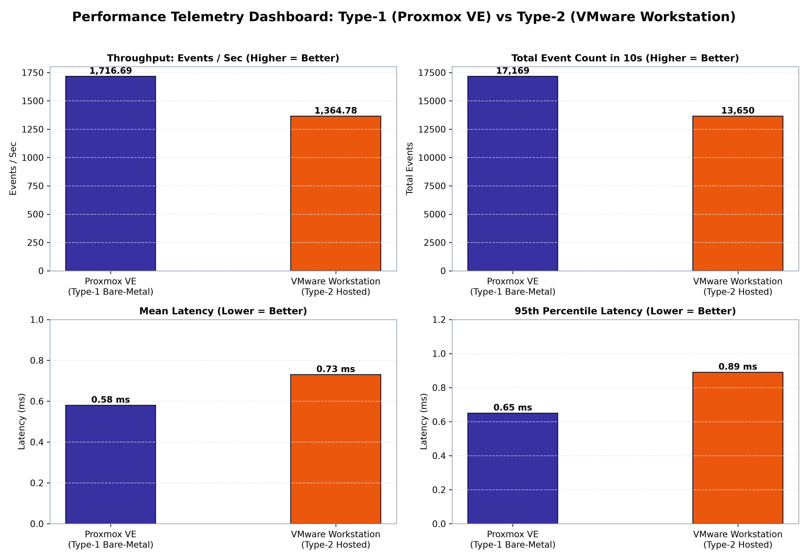

# Cloud Computing Laboratory

A curated repository of practical experiments, benchmark studies, automation scripts, and technical reports conducted for the **Cloud Computing Laboratory** course.

---

## 🔬 Practicals & Lab Modules

### [Lab 01: Hypervisor Computational Performance Benchmarking](./Lab-01-Hypervisor-Benchmarking/)

An empirical evaluation comparing bare-metal (**Type-1: Proxmox VE / KVM**) and hosted (**Type-2: VMware Workstation on Windows 11**) virtualization architectures under standardized computational stress.

- **Workload**: CPU prime number computation to 20,000 via `sysbench`
- **Guest Configuration**: Ubuntu 24.04 LTS, 2 vCPUs, 2 GB RAM, 20 GB Virtual Disk
- **Key Finding**: Proxmox VE demonstrated a **+25.78% throughput increase** (1,716.69 vs 1,364.78 EPS) and a **20.55% reduction in mean processing latency** (0.58 ms vs 0.73 ms) due to the absence of host OS scheduling preemption and intermediate VM-exit penalties.

#### Quick Telemetry Comparison

| Evaluation Metric | Proxmox VE (Type-1) | VMware Workstation (Type-2) | Advantage |
| :--- | :---: | :---: | :--- |
| **Throughput (Events/sec)** | **1,716.69** | 1,364.78 | **+25.78% (Type-1 speedup)** |
| **Total Events (10s window)**| **17,169** | 13,650 | **+3,519 events completed** |
| **Average Latency** | **0.58 ms** | 0.73 ms | **20.55% lower latency** |
| **95th Percentile Latency** | **0.65 ms** | 0.89 ms | **26.97% lower tail latency** |
| **Max Latency Spike** | **2.78 ms** | 4.06 ms | **31.53% less jitter** |

<p align="center">
  
</p>

- 📄 **[Full Academic Lab Report](./Lab-01-Hypervisor-Benchmarking/Lab%20Report.md)**: Formal evaluation report with hardware architecture theory, context-switch breakdowns, and mathematical derivations.
- 📘 **[Lab 01 Walkthrough & Guide](./Lab-01-Hypervisor-Benchmarking/README.md)**: In-depth setup, step-by-step reproduction instructions, and analytical findings.
- ⚙️ **[Lab Scripts](./Lab-01-Hypervisor-Benchmarking/script/)**: Automated benchmark harness, telemetry parser, and plot generator.

---

## 📁 Repository Organization

```text
cc-lab/
├── README.md                                  # Repository overview and lab directory
│
└── Lab-01-Hypervisor-Benchmarking/            # Module 01: Hypervisor Benchmarking
    ├── Lab Report.md                          # Full laboratory write-up and analysis
    ├── README.md                              # Module documentation and reproduction guide
    ├── images/                                # High-resolution plots and terminal logs
    │   ├── overall_performance_dashboard.png
    │   ├── events_per_second_comparison.png
    │   ├── latency_comparison.png
    │   ├── total_events_comparison.png
    │   ├── Lab 1.jpeg
    │   └── Lab 2.jpeg
    └── script/                                # Reproducibility & telemetry tools
        ├── benchmark.sh                       # Shell automation for guest audit & sysbench
        ├── parse_sysbench.py                  # Telemetry parsing & delta calculation engine
        └── generate_plots.py                  # Matplotlib script generating visual figures
```

---

## 🚀 Quick Start & Reproducibility

### 1. Ingest & Compare Telemetry
Run the analytical comparison engine to inspect deltas across both test runs:
```bash
python Lab-01-Hypervisor-Benchmarking/script/parse_sysbench.py
```

### 2. Generate Visual Figures
Recreate the publication-grade telemetry charts:
```bash
python Lab-01-Hypervisor-Benchmarking/script/generate_plots.py
```

### 3. Run Benchmark on a Linux Guest VM
To execute the automated audit and benchmark suite on any Ubuntu/Debian virtual machine:
```bash
chmod +x Lab-01-Hypervisor-Benchmarking/script/benchmark.sh
./Lab-01-Hypervisor-Benchmarking/script/benchmark.sh
```

---

## 🧰 Technology & Environment Stack

- **Hypervisors**: Proxmox VE 8.x (Bare-Metal KVM) | VMware Workstation Pro 17.x
- **Guest Operating System**: Ubuntu Server 24.04 LTS (x86_64)
- **Workload Benchmark**: `sysbench` (Prime Sieve integer stress test)
- **Scripting & Telemetry**: Python 3.10+, Bash shell automation
- **Visualization**: Matplotlib & NumPy
